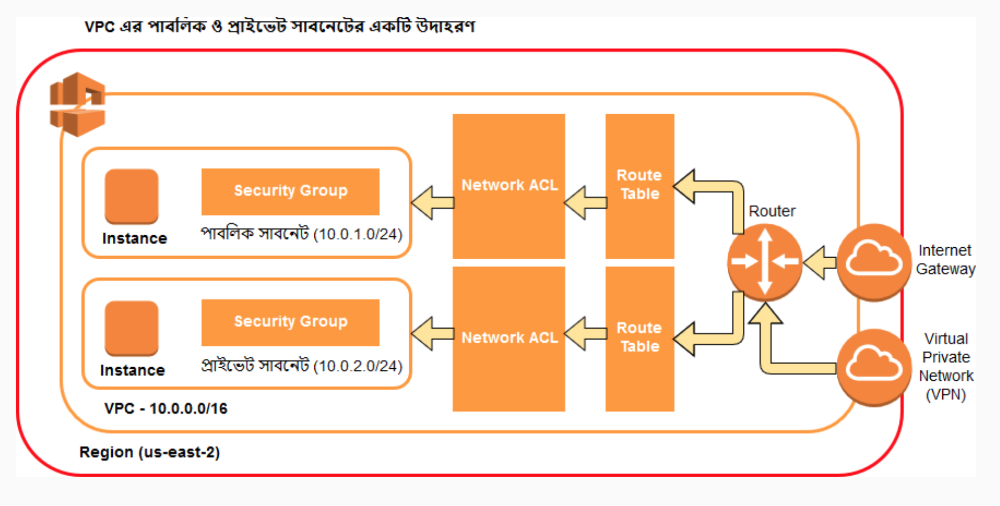
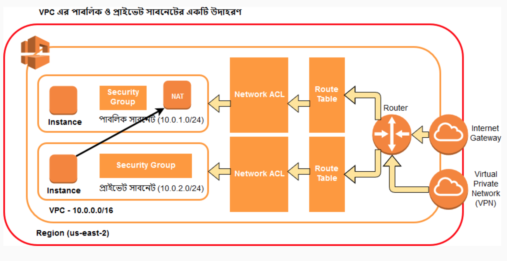

## VPC - Virtual Private Cloud
Its a virtual private cloud which makes the instances or machines different from other account machines. Mainly it is a boundary in the region. Instances, RDS and etc are created on this VPC. There is a default VPC always connected to the AWS account.

## Subnet
Subnet is another isolation in the VPC. It is a range of ip addresses.  
There are two types of subnet - 
1. Public subnet
2. Private subnet

## VPN - Virtual Private Network
Its a channel to communicate through this. It is secured and used for communication.

* Useful site to calculate [CIDR](http://www.cidr.xyz)
* Ony one gateway is attached to a VPC
* IP address can be blocked using Network ACL
* Route table is used to control the access from one subnet to another
* Route table, Network ACL & Security Group are created with the creation of a VPC
* Internet gateway and subnet are nor created with the creation of VPC.

## Nat Instance
As our private servers are not connected to the internet, so we can't install any thing to our private servers. So here comes NAT instance to help us. We will create an instance using NAT community image in the public subnet and then connect it to the private route using route table.

## NAT Gateway
It is the new feature to lessen the hassle of creating NAT instance. We will just create a NAT gateway in out public subnet and connect it to the private route as NAT gateway. Thats it. How easy it is.