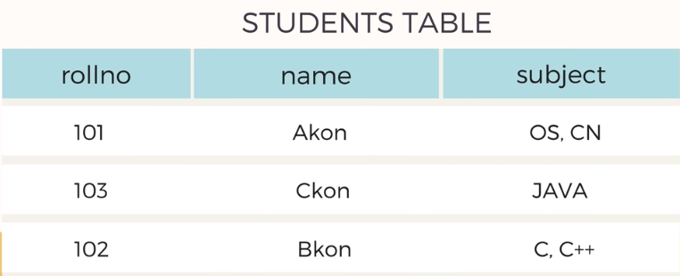

# 1st Normal Form

This is the basic of all the normal forms. 
There are 4 rules to maintain 1st normal form.

1. Each column should contain atomic values. That means no column should contain more than 1 value.
2. A column should have the same type for all the rows. If one column has data type, then all the columns should have date type.
3. Each column should have an unique name.
4. Order in which data is entered should not matter.

## Example

On this table, we can see that we have maintained all the 3 rules but have not maintained the rule number 1. Row 1 and 3 have more than 1 value. So how to solve this?

### Solution

So the solution is simple, break the 2 rows into 4 rows. That will create some redundant data, but it will maintain 1st Normal Form.
  
