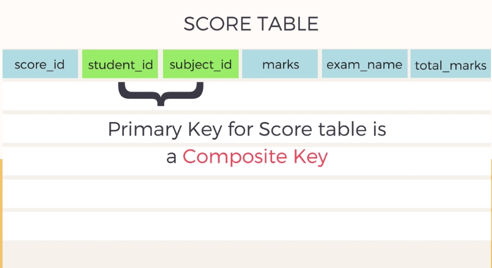

# 3rd Normal Form

There are 3 rules to maintain 3rd normal form

1. It should be on 1st normal form
2. It should be on 2nd normal form
3. It should not have Transitive Dependency

## What is Transitive Dependency

So have a look on the above table. The primary id if that table is `student_id + subject_id`. All the other columns should be dependent on this primary id. Lets think about the last two columns.

**exam_name** is dependent on the primary key as there can be theoratiocal and practical exam of a subject. Like C++, it has both theoratical and practical exam. 

**total_marks** is not dependent on the primary key, hence it is dependent on the exam_name. For example, if the exam is theoratiocal, then the total mark is 100 and if its practical then it can be 30-40.

This is called Transitive Dependency. If any of the columns doesn't depend on the primary key and depends on another column, then the table has Transitive Dependency.

## Solution

Remove the total_marks column and form another table consists of the columns (exam_name, total_marks). Then this table follows 3NF.