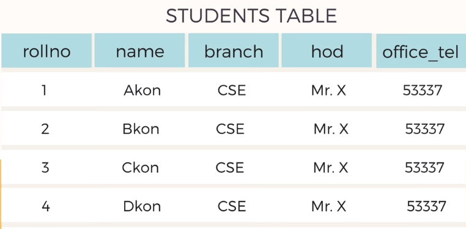

# Normalization

Normalization is used to avoid data redundancy. Data is divided into multiple related tables so that data is not repeated multiple times.

## Problems of Data Redundancy

### Insertion Anomaly

If we want to insert a new row on the above database, we have to insert the same last theree columns.

### Deletion Anomaly

If we delete all the information from this table, then we will lose some informations with it, like who is HOD(head of dept.) for CSE branch

### Updation Anomaly

If Mr.X leaves and Mr.Y joins for HOD then we have to update all th fields, which is not necessary

## Solution

So what is the solution for the above problem ??  
For this, we have to breat the one database into two databases, consisting of columns **Student_DB**(rollno, name, branch) & **Branch_DB**(branch, hod, branch_tel)

## Types of Normalization

1. 1st Noraml Form (1NF)
2. 2nd Normal Form (2NF)
3. 3rd Normal Form (3NF)
4. Boyce-Codd Normal Form (BCNF / 3.5NF)
5. 4th Normal Form (4NF)

