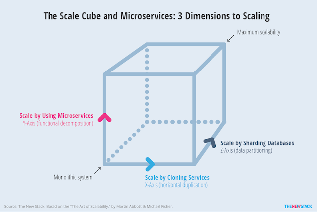

## Monolith vs Microservices

#### Problems of Mololith

1. Technology Dependency
2. Engineering Focus
3. Scaling Data Layer
4. Overloaded VM/Containers
5. CI/CD tests, build & conflicts
6. Understanding the code for new devs

#### Advantages of Microservice

1. Scaling easy
2. Deploy easy
3. Different Technology usage
4. Faster to develop and understand
5. Loosely Coupled

#### Disadvantages of Microservice

1. Inter Process Communication
2. Distributed transactions
3. More resources
4. Debugging issues

## Scale Cube

#### Functional Decomposition

On the functional decomposition, we can devide our functions more. Like we have a product service which could search and list product. We can decompose it into two different services, one for search and another for listing.

#### Data Partioning

We can divide our data into different partions. Like using the first letter of usernames, we can partition the data into A-B, C-X, Y-Z. So if I have a get or post request on user B, we will use the first db and for the user D, we will use the 2nd DB.

#### Horizontal Scaling

On that part, we can make our servers bigger. By using more cores or more rams. But obviously there is a hard limit to it. So it is not always recommended.

## API Gateway

Front facing service for all the microservices. Frontend will call the API Gateway and API will transfer it to the dedicated service. There can be 2 scenerios

1. Frontend will call API Gateway n times to get n information about one single element (N number of API)
2. Frontend will call API Gateway once and the API gateway will call n services and compose all the data to the Frontend. Its also API Composition.

Another version of API Gateway can be **Backend For Frontend (BFF)**, where for mobile, web or third party will get different API gateway.

#### Advanteages

1. **Authentication** can be done on the API Gateway
2. **SSL Termination**. Maybe the Frontend calls the API Gateway with HTTPS. But the API gateway can call other services using only HTTP / WS / HTTPS / RPC
3. **Load Balancer**: API gateway can act as the load balancer for the N services
4. **Insulation**: Client has no direct access to all the microservices and those can be changed anytime w/o the change of client code
5. Can also help on - 
   1. Caching
   2. Managing access quotas
   3. API health monitoring
   4. API versioning
   5. Chaos monkey testing
   6. A/B testing

#### Disadvaantages

1. Complicated
2. High latency

## Service Registry

There are two ways a microserive can register his ip and port on the server register

1. **Self**: When the service begins, it will register it self on the database
2. **Third Party**: Service Register will constantly monitor the cluster and when a service spawns, the SR heaars it and register the service

## Service Discovery

There are two ways the service registry can be discovered - 

1. **Client**: Client can directly connect with service registry to get the config of the services. In that case the client need to pull the data after a definite time. It is not recommended as the number of connections to the SR will be huge
2. **Server**: On this patter, API Gateway will connect with the SR to get the updated config. (**Recommended**)

## Inter Microservices Communication

This can be done 2 ways

1. **Synchronous Calling**: On the function will call other API endpoints and wait for their responses. 

   #### Advantages of Synchronous Calling

   1. Easy
   2. Realtime

   #### Disadvantages of Synchronous Calling

   1. Service Availability
   2. Response Time

2. **Asynchronous Calling**: If the MS1 is dependent on MS2, then MS1 will push a message to the queue of the MS2. And the MS2 is constantly monitoring its queue. So when it hears a message on the queue, it pulls the message and work accordingly.

   #### Advantages of Asynchronous Calling

   1. Faster API
   2. Decoupled services
   3. Works even when services are down
   4. No need for service discovery

   #### Disadvantages of Asynchronous Calling

   1. Complex Design
   2. Process Latency
   3. Monitoring costs

## Circuit Breaker

Let's say if you have 3 micorservices, (MS1, MS2, MS3), MS1 is calling MS2 and MS2 is calling MS3. So if MS3 is not available for some reason or overloaded, then the whole response will be error. If the circuit breaker is implemented on the MS1 or MS2, then it could do 2 things 

1. Send **Cached Response**
2. Send request to a **Fallback Service**

Moreover, if the MS3 is down for 2-3 or more requests, then circuit breaker will not give request to the MS3 anymore and do one of the two things. And after a predefined time, it will try to contact MS3, if it has healed or not. If it has, then it will again send request to MS3. Otherwise, again wait for the predefined time.

* **Closed** means everything is working fine and the connection between MS1 to MS2 to MS3 is working fine and in closed connection.
* **Open** means the MS3 service is down and connection is open.
* **Half Open** means after the down, it has waited for predefined time and will check if the service is okay or not. If it is, then the connection will be closed. Otherwise, it will be open again.

